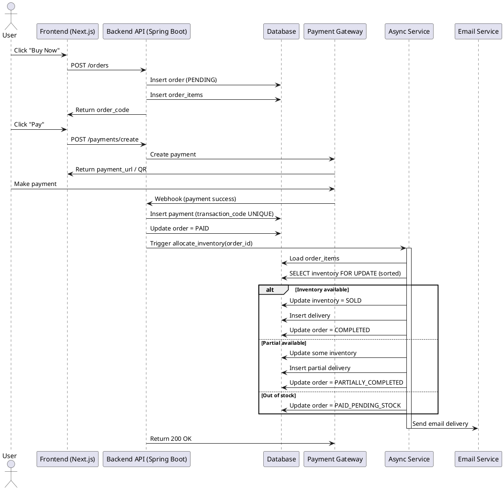
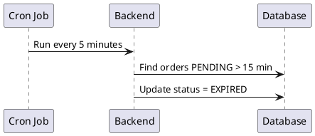
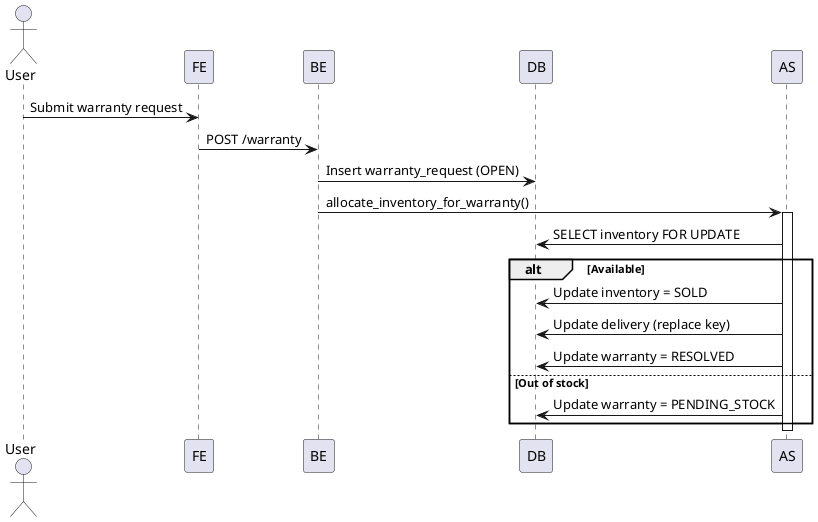
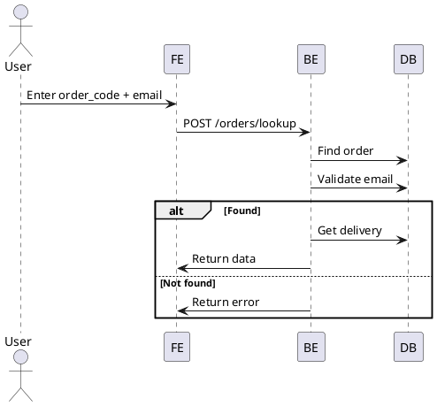
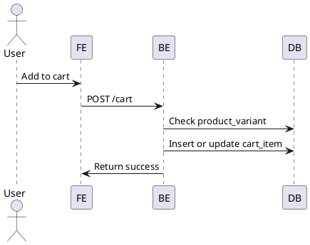
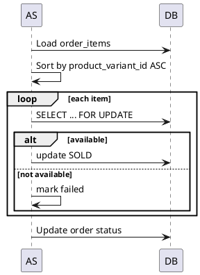
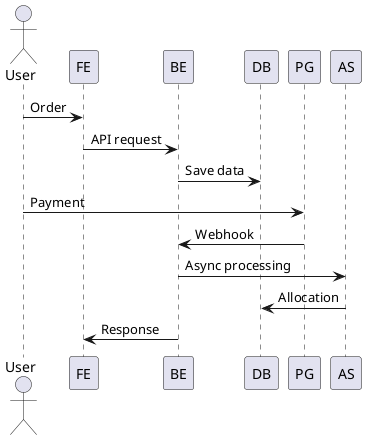

# SEQUENCE DIAGRAM SPECIFICATION
**Project:** Digital Goods E-commerce Platform (Shop August)

---

## 1. ORDER + PAYMENT + DELIVERY FLOW

---

## 2. PAYMENT TIMEOUT FLOW

---

## 3. WARRANTY FLOW

---

## 4. ORDER LOOKUP FLOW

---

## 5. CART FLOW

---

## 6. DEADLOCK-SAFE INVENTORY FLOW (DETAIL)

---

## 7. SYSTEM OVERVIEW FLOW

